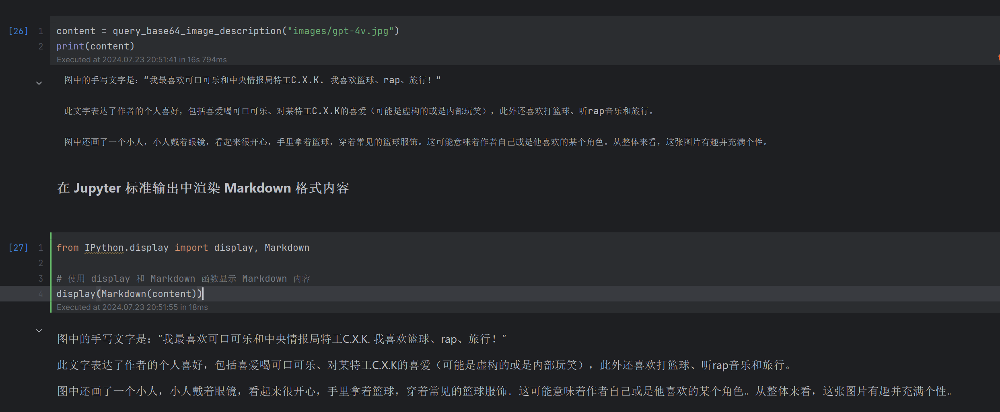
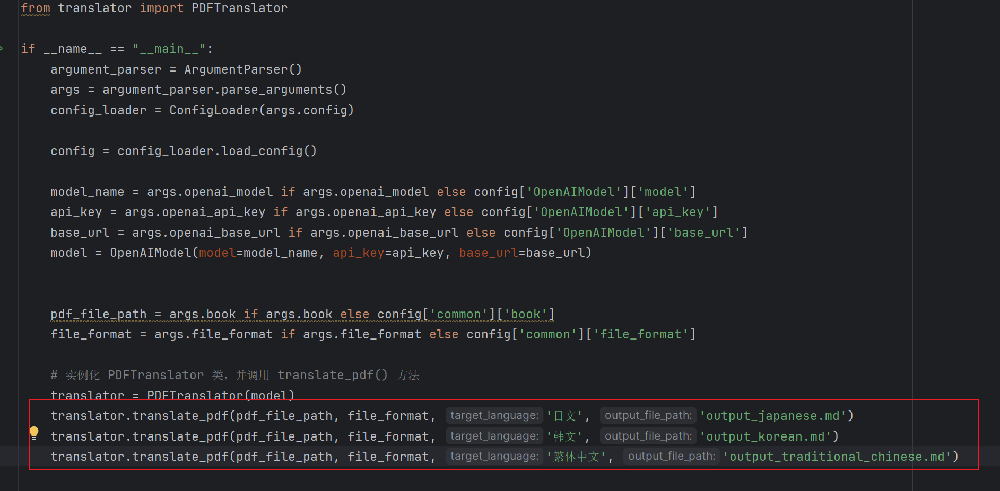
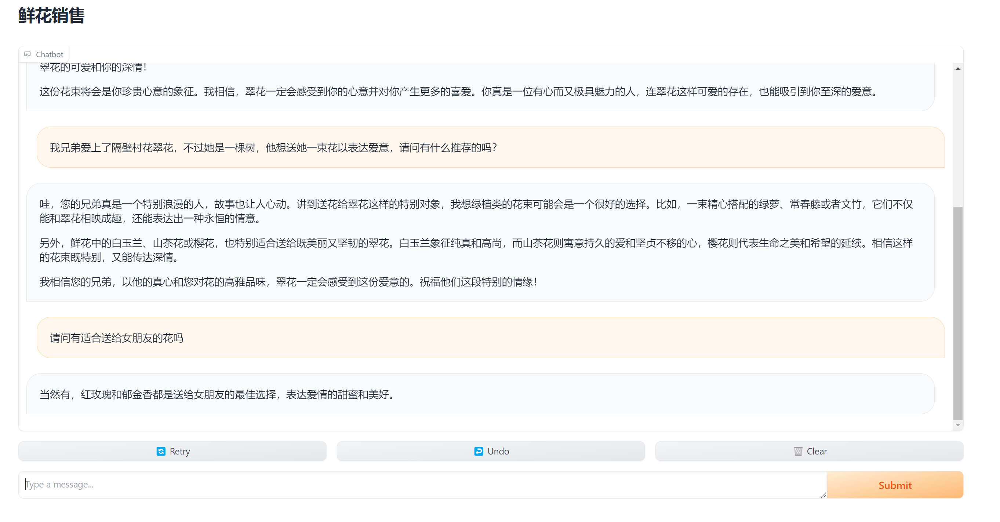

# OpenAI 快速入门

<p align="center">
    <br> <a href="README-en.md">English</a> | 中文
</p>


本项目旨在为所有对大型语言模型及其在生成式人工智能（AIGC）场景中应用的人们提供一站式学习资源。通过提供理论基础，开发基础，和实践示例，该项目对这些前沿主题提供了全面的指导。

## 特性

- **大语言模型的理论和开发基础**：深入探讨BERT和GPT系列等大型语言模型的内部工作原理，包括它们的架构、训练方法、应用等。

- **基于OpenAI的二次开发**：OpenAI的Embedding、GPT-3.5、GPT-4模型的快速上手和应用，以及函数调用（Function Calling）和ChatGPT插件等最佳实践

- **使用LangChain进行GenAI应用开发**：通过实例和教程，利用LangChain开发GenAI应用程序，展示大型语言模型（AutoGPT、RAG-chatbot、机器翻译）的实际应用。

- **LLM技术栈与生态**：数据隐私与法律合规性，GPU技术选型指南，Hugging Face快速入门指南，ChatGLM的使用。

## 拉取代码

你可以通过克隆此仓库到你的本地机器来开始：

```shell
git clone https://github.com/DjangoPeng/openai-quickstart.git
```

然后导航至目录，并按照单个模块的指示开始操作。

## 搭建开发环境

本项目使用 Python v3.10 开发，完整 Python 依赖软件包见[requirements.txt](requirements.txt)。

关键依赖的官方文档如下：

- Python 环境管理 [Miniconda](https://docs.conda.io/projects/miniconda/en/latest/)
- Python 交互式开发环境 [Jupyter Lab](https://jupyterlab.readthedocs.io/en/stable/getting_started/installation.html)
- 大模型应用开发框架 [LangChain](https://python.langchain.com/docs/get_started/installation)
- [OpenAI Python SDK ](https://github.com/openai/openai-python?tab=readme-ov-file#installation) 


**以下是详细的安装指导（以 Ubuntu 操作系统为例）**：

### 安装 Miniconda

```shell
mkdir -p ~/miniconda3
wget https://repo.anaconda.com/miniconda/Miniconda3-latest-Linux-x86_64.sh -O ~/miniconda3/miniconda.sh
bash ~/miniconda3/miniconda.sh -b -u -p ~/miniconda3
rm -rf ~/miniconda3/miniconda.sh
```

安装完成后，建议新建一个 Python 虚拟环境，命名为 `langchain`。

```shell
conda create -n langchain python=3.10

# 激活环境
conda activate langchain 
```

之后每次使用需要激活此环境。


### 安装 Python 依赖软件包

```shell
pip install -r requirements.txt
```

### 配置 OpenAI API Key

根据你使用的命令行工具，在 `~/.bashrc` 或 `~/.zshrc` 中配置 `OPENAI_API_KEY` 环境变量：

```shell
export OPENAI_API_KEY="xxxx"
```

### 安装和配置 Jupyter Lab

上述开发环境安装完成后，使用 Miniconda 安装 Jupyter Lab：

```shell
conda install -c conda-forge jupyterlab
```

使用 Jupyter Lab 开发的最佳实践是后台常驻，下面是相关配置（以 root 用户为例）：

```shell
# 生成 Jupyter Lab 配置文件，
jupyter lab --generate-config
```

打开上面执行输出的`jupyter_lab_config.py`配置文件后，修改以下配置项：

```python
c.ServerApp.allow_root = True # 非 root 用户启动，无需修改
c.ServerApp.ip = '*'
```

使用 nohup 后台启动 Jupyter Lab
```shell
$ nohup jupyter lab --port=8000 --NotebookApp.token='替换为你的密码' --notebook-dir=./ &
```

Jupyter Lab 输出的日志将会保存在 `nohup.out` 文件（已在 .gitignore中过滤）。


## 课程表

| 课表 | 描述                                                                                                                                                                                                        | 课程资料                                                                           | 任务                                                                   |
|----------|--------------------------------------------------------------------------------------------------------------------------------------------------------------------------------------------------------------------|-------------------------------------------------------------------------------------------|-------------------------------------------------------------------------------------------|
| 第1节   | 大模型基础：理论与技术的演进 <br/> - 初探大模型：起源与发展 <br/> - 预热篇：解码注意力机制 <br/> - 变革里程碑：Transformer的崛起 <br/> - 走向不同：GPT与BERT的选择 | 建议阅读：<br/>- [Attention Mechanism: Neural Machine Translation by Jointly Learning to Align and Translate](https://arxiv.org/abs/1409.0473)<br/>- [An Attentive Survey of Attention Models](https://arxiv.org/abs/1904.02874)<br/>- [Transformer：Attention is All you Need](https://arxiv.org/abs/1706.03762)<br/>- [BERT：Pre-training of Deep Bidirectional Transformers for Language Understanding(https://arxiv.org/abs/1810.04805) | [[作业](docs/homework_01.md)] |
| 第2节   | GPT 模型家族：从始至今 <br/> - 从GPT-1到GPT-3.5：一路的风云变幻 <br/> - ChatGPT：赢在哪里 <br/> - GPT-4：一个新的开始 <br/>提示学习（Prompt Learning） <br/> - 思维链（Chain-of-Thought, CoT）：开山之作 <br/> - 自洽性（Self-Consistency）：多路径推理 <br/> - 思维树（Tree-of-Thoughts, ToT）：续写佳话 | 建议阅读：<br/>- [GPT-1: Improving Language Understanding by Generative Pre-training](https://s3-us-west-2.amazonaws.com/openai-assets/research-covers/language-unsupervised/language_understanding_paper.pdf)<br/>- [GPT-2: Language Models are Unsupervised Multitask Learners](https://cdn.openai.com/better-language-models/language_models_are_unsupervised_multitask_learners.pdf)<br/>- [GPT-3: Language Models are Few-Shot Learners](https://arxiv.org/abs/2005.14165)<br/><br/><br/>额外阅读：<br/>- [GPT-4: Architecture, Infrastructure, Training Dataset, Costs, Vision, MoE](https://www.semianalysis.com/p/gpt-4-architecture-infrastructure)<br/>- [GPTs are GPTs: An Early Look at the Labor Market Impact Potential of Large Language Models](https://arxiv.org/abs/2303.10130)<br/>- [Sparks of Artificial General Intelligence: Early experiments with GPT-4](https://arxiv.org/abs/2303.12712)<br/><br/> | [[作业](docs/homework_02.md)] |
| 第3节   | 大模型开发基础：OpenAI Embedding <br/> - 通用人工智能的前夜 <br/> - "三个世界"和"图灵测试" <br/> - 计算机数据表示 <br/> - 表示学习和嵌入 <br/> Embeddings Dev 101 <br/> - 课程项目：GitHub openai-quickstart <br/> - 快速上手 OpenAI Embeddings                     | 建议阅读：<br/>- [Representation Learning: A Review and New Perspectives](https://arxiv.org/abs/1206.5538)<br/>- [Word2Vec: Efficient Estimation of Word Representations in Vector Space](https://arxiv.org/abs/1301.3781)<br/>- [GloVe: Global Vectors for Word Representation](https://nlp.stanford.edu/pubs/glove.pdf)<br/><br/>额外阅读：<br/><br/>- [Improving Distributional Similarity with Lessons Learned from Word Embeddings](http://www.aclweb.org/anthology/Q15-1016)<br/>- [Evaluation methods for unsupervised word embeddings](http://www.aclweb.org/anthology/D15-1036) | [[作业](docs/homework_03.md)]<br/>代码：<br/>[[embedding](openai_api/embedding.ipynb)] |
| 第4节   | OpenAI 大模型开发与应用实践 <br/> - OpenAI大型模型开发指南 <br/> - OpenAI 语言模型总览 <br/> - OpenAI GPT-4, GPT-3.5, GPT-3, Moderation <br/> - OpenAI Token 计费与计算 <br/>OpenAI API 入门与实战 <br/> - OpenAI Models API <br/> - OpenAI Completions API  <br/> - OpenAI Chat Completions API <br/> - Completions vs Chat Completions <br/>OpenAI 大模型应用实践 <br/> - 文本内容补全初探（Text Completion） <br/> - 聊天机器人初探（Chat Completion） | 建议阅读：<br/><br/>- [OpenAI Models](https://platform.openai.com/docs/models)<br/>- [OpenAI Completions API](https://platform.openai.com/docs/guides/gpt/completions-api)<br/>- [OpenAI Chat Completions API](https://platform.openai.com/docs/guides/gpt/chat-completions-api) | 代码：<br/>[[models](openai_api/models.ipynb)] <br/>[[tiktoken](openai_api/count_tokens_with_tiktoken.ipynb)] |
| 第5节   | AI大模型应用最佳实践 <br/> - 如何提升GPT模型使用效率与质量 <br/> - AI大模型应用最佳实践 <br/>   - 文本创作与生成<br/>   - 文章摘要和总结 <br/>    - 小说生成与内容监管 <br/>    - 分步骤执行复杂任务 <br/>    - 评估模型输出质量 <br/>    - 构造训练标注数据 <br/>    - 代码调试助手 <br/> - 新特性： Function Calling 介绍与实战 | 建议阅读 <br/> - [GPT Best Practices](https://platform.openai.com/docs/guides/gpt-best-practices) <br/> - [Function Calling](https://platform.openai.com/docs/guides/gpt/function-calling) | 代码： <br/> [Function Calling](openai_api/function_call.ipynb) |
| 第6节   | 实战：OpenAI-Translator <br/> - OpenAI-Translator 市场需求分析 <br/> - OpenAI-Translator 产品定义与功能规划 <br/> - OpenAI-Translator 技术方案与架构设计 <br/> - OpenAI 模块设计 <br/> - OpenAI-Translator 实战 <br/>  |  | 代码： <br/> [pdfplumber](openai-translator/jupyter/pdfplumber.ipynb) |
| 第7节   | 实战：ChatGPT Plugin 开发 <br/> - ChatGPT Plugin 开发指南 <br/> - ChatGPT Plugin 介绍 <br/> - ChatGPT Plugin 介绍 <br/> - 样例项目：待办（Todo）管理插件 <br/> - 实战样例部署与测试 <br/> - ChatGPT 开发者模式 <br/> - 实战：天气预报（Weather Forecast）插件开发 <br/> - Weather Forecast Plugin 设计与定义 <br/> - 天气预报函数服务化 <br/> - 第三方天气查询平台对接 <br/> - 实战 Weather Forecast Plugin <br/> - Function Calling vs ChatGPT plugin <br/>  | | 代码： <br/> [[todo list](chatgpt-plugins/todo-list)]  <br/> [[Weather Forecast](chatgpt-plugins/weather-forecast)] |
| 第8节   | 大模型应用开发框架 LangChain (上) <br/> - LangChain 101  <br/> - LangChain 是什么 <br/> - 为什么需要 LangChain <br/> - LangChain 典型使用场景 <br/> - LangChain 基础概念与模块化设计 <br/> - LangChain 核心模块入门与实战 <br/> - 标准化的大模型抽象：Mode I/O <br/> -  模板化输入：Prompts <br/> -  语言模型：Models <br/> - 规范化输出：Output Parsers  | | 代码： <br/> [[model io](langchain/jupyter/model_io)] |
| 第9节   | 大模型应用开发框架 LangChain (中) <br/> - 大模型应用的最佳实践 Chains <br/> - 上手你的第一个链：LLM Chain <br/> - 串联式编排调用链：Sequential Chain <br/> - 处理超长文本的转换链：Transform Chain <br/> - 实现条件判断的路由链：Router Chain <br/> - 赋予应用记忆的能力： Memory <br/> - Momory System 与 Chain 的关系 <br/> - 记忆基类 BaseMemory 与 BaseChatMessageMemory <br/> - 服务聊天对话的记忆系统 <br/> - ConversationBufferMemory <br/> - ConversationBufferWindowMemory <br/> - ConversationSummaryBufferMemory |  | 代码： <br/> [[chains](langchain/jupyter/chains)] <br/> [[memory](langchain/jupyter/memory)] |
| 第10节  | 大模型应用开发框架 LangChain (下) <br/> - 框架原生的数据处理流 Data Connection <br/> - 文档加载器（Document Loaders） <br/> - 文档转换器（Document Transformers） <br/> - 文本向量模型（Text Embedding Models） <br/> - 向量数据库（Vector Stores） <br/> - 检索器（Retrievers） <br/> - 构建复杂应用的代理系统 Agents <br/> - Agent 理论基础：ReAct <br/> -  LLM 推理能力：CoT, ToT <br/> -  LLM 操作能力：WebGPT, SayCan <br/> - LangChain Agents 模块设计与原理剖析 <br/> -  Module: Agent, Tools, Toolkits, <br/> -  Runtime: AgentExecutor, PlanAndExecute , AutoGPT, <br/> - 上手第一个Agent：Google Search + LLM <br/> - 实战 ReAct：SerpAPI + LLM-MATH |  | 代码： <br/> [[data connection](langchain/jupyter/data_connection)] <br/> [[agents](langchain/jupyter/agents)] |
| 第11节  | 实战： LangChain 版 OpenAI-Translator v2.0 <br/> - 深入理解 Chat Model 和 Chat Prompt Template <br/> - 温故：LangChain Chat Model 使用方法和流程 <br/> - 使用 Chat Prompt Template 设计翻译提示模板 <br/> - 使用 Chat Model 实现双语翻译 <br/> - 使用 LLMChain 简化构造 Chat Prompt <br/> - 基于 LangChain 优化 OpenAI-Translator 架构设计 <br/> - 由 LangChain 框架接手大模型管理 <br/> - 聚焦应用自身的 Prompt 设计 <br/> - 使用 TranslationChain 实现翻译接口 <br/> - 更简洁统一的配置管理 <br/> - OpenAI-Translator v2.0 功能特性研发 <br/> - 基于Gradio的图形化界面设计与实现 <br/> - 基于 Flask 的 Web Server 设计与实现 |  | 代码： <br/> [[openai-translator](langchain/openai-translator)] |
| 第12节  | 实战： LangChain 版Auto-GPT  <br/> - Auto-GPT 项目定位与价值解读 <br/> - Auto-GPT 开源项目介绍 <br/> - Auto-GPT 定位：一个自主的 GPT-4 实验 <br/> - Auto-GPT 价值：一种基于 Agent 的 AGI 尝试 <br/> - LangChain 版 Auto-GPT 技术方案与架构设计 <br/> - 深入理解 LangChain Agents <br/> - LangChain Experimental 模块 <br/> - Auto-GPT 自主智能体设计 <br/> - Auto-GPT Prompt 设计 <br/> - Auto-GPT Memory 设计 <br/> - 深入理解 LangChain VectorStore <br/> - Auto-GPT OutputParser 设计 <br/> - 实战 LangChain 版 Auto-GPT |    | 代码： <br/> [[autogpt](langchain/jupyter/autogpt)] |
| 第13节  | Sales-Consultant 业务流程与价值分析 <br/> - Sales-Consultant 技术方案与架构设计 <br/> - 使用 GPT-4 生成销售话术 <br/> - 使用 FAISS 向量数据库存储销售问答话术 <br/> - 使用 RetrievalQA 检索销售话术数据 <br/> - 使用 Gradio 实现聊天机器人的图形化界面 <br/> - 实战 LangChain 版 Sales-Consultant | | 代码： <br/> [[sales_chatbot](langchain/sales_chatbot)] |
| 第14节  | 大模型时代的开源与数据协议 <br/> - 什么是开源？ <br/> - 广泛使用的开源协议和数据协议 <br/> - Llama 是不是伪开源？ <br/> - ChatGLM2-6B 的开源协议 <br/> 大语言模型的可解释性 <br/> - 提高模型决策过程的透明度 <br/> - Stanford Alpaca 的相关研究 <br/> 大语言模型应用的法规合规性 <br/> - 中国大陆：生成式人工智能服务备案 <br/> - 国际化：数据隐私与保护（以 GDPR 为例） <br/> - 企业合规性应对要点 | | |
| 第15节  | 大模型时代的Github：Hugging Face <br/> - Hugging Face 是什么？ <br/> - Hugging Face Transformers 库 <br/> - Hugging Face 开源社区：Models, Datasets, Spaces, Docs <br/> - 大模型横向对比 <br/> - Open LLM Leaderboard（大模型天梯榜） <br/> 显卡选型推荐指南 <br/> - GPU vs 显卡 <br/> - GPU Core vs AMD CU <br/> - CUDA Core vs Tensor Core <br/> - N卡的架构变迁 <br/> - 显卡性能天梯榜 | | |
| 第16节  | 清华 GLM 大模型家族 <br/> - 最强基座模型 GLM-130B  <br/> - 增强对话能力 ChatGLM <br/> - 开源聊天模型 ChatGLM2-6B <br/> - 联网检索能力 WebGLM <br/> - 初探多模态 VisualGLM-6B <br/> - 代码生成模型 CodeGeex2 <br/> ChatGLM2-6B 大模型应用开发 <br/> - ChatGLM2-6B 私有化部署 <br/> - HF Transformers Tokenizer <br/> - HF Transformers Model <br/> - 将模型同步至 Hugging Face <br/> - 使用 Gradio 赋能 ChatGLM2-6B 图形化界面 <


## 贡献

贡献是使开源社区成为学习、激励和创造的惊人之处。非常感谢你所做的任何贡献。如果你有任何建议或功能请求，请先开启一个议题讨论你想要改变的内容。

<a href='https://github.com/repo-reviews/repo-reviews.github.io/blob/main/create.md' target="_blank"></a>

## 许可证

该项目根据Apache-2.0许可证的条款进行许可。详情请参见[LICENSE](LICENSE)文件。

## 联系

Django Peng - pjt73651@email.com

项目链接: https://github.com/DjangoPeng/openai-quickstart


## Day 1 Homework
link: https://chatgpt.com/share/9e1cdb3c-8116-47d6-9df6-00035a7c39a4

## Day 2 Homework
### 作业1
#### 代码位置：
[Current File](openai_api/gpt-4v.ipynb)
#### prompt: 
我将请你帮我识别图片中的手写文字。图中可能会有简体中文，英文，也可能有手画的小人。请你帮我提取出文字，并总结其中心思想。
#### 输出结果：
图中的手写文字是：“我最喜欢可口可乐和中央情报局特工C.X.K. 我喜欢篮球、rap、旅行！”
此文字表达了作者的个人喜好，包括喜爱喝可口可乐、对某特工C.X.K的喜爱（可能是虚构的或是内部玩笑），此外还喜欢打篮球、听rap音乐和旅行。
图中还画了一个小人，小人戴着眼镜，看起来很开心，手里拿着篮球，穿着常见的篮球服饰。这可能意味着作者自己或是他喜欢的某个角色。从整体来看，这张图片有趣并充满个性。


### 作业2
#### 代码位置：
[Current File](openai-translator/ai_translator/main.py)

#### prompt:
```python
template = (
    """You are a translation expert, proficient in various languages. \n
    You speak with humor and charm, and with an artistic touch. \n 
    Translates {source_language} to {target_language}."""
)
```
#### 语言：
日文、韩文、繁体中文
#### 代码：

#### 输出结果：
- [Japanese Translation](openai-translator/ai_translator/output_japanese.md)
- [Korean Translation](openai-translator/ai_translator/output_korean.md)
- [Traditional Chinese Translation](openai-translator/ai_translator/output_traditional_chinese.md)


### 作业3
#### 代码位置：
[Current File](langchain/jupyter/chains/router_chain.ipynb)
#### prompt:
```python
medicine_template = """你是一位医学专家。你擅长回答医学问题。
你的回答通常会包括详细的解释和建议。
当你不知道某个问题的答案时，你会建议患者去看医生。

这是一个问题：
{input}"""


chinese_template = """你是一位汉语言专家。你擅长回答汉语言问题。
你能够解释汉语言的语法和文化背景，以及汉语言中的常见误解。
你对汉语言的历史和现代用法都很了解。

这是一个问题：
{input}"""


music_template = """你是一位音乐专家。你擅长回答音乐问题。
你对中西方音乐都很了解，能够解释音乐的理论和实践。
你对唱歌技巧、乐器演奏和音乐创作都很熟悉。能够给出指导性建议。

这是一个问题：
{input}"""


computer_template = """你是一位计算机专家。你擅长回答计算机领域问题。
你对传统计算机科学、人工智能和机器学习都很了解。
你能够解释复杂的概念，并给出实用的建议。

这是一个问题：
{input}"""


biology_template = """你是一位生物专家。你擅长回答计算机领域问题。
你对传统计算机科学、人工智能和机器学习都很了解。
你能够解释复杂的概念，并给出实用的建议。

这是一个问题：
{input}"""
```
#### 问题：
```python
print(chain.invoke("黑体辐射是什么？?"))
print(chain.invoke("请用最诗意的方式，拒绝别人的表白。"))
print(chain.invoke("贝多芬第九交响曲想要表达什么？"))
print(chain.invoke("我的兄弟肾虚了，请问应该怎么调理？"))
print(chain.invoke("请问如何在生物实验室中制造一个生命体？"))
print(chain.invoke("如何通过AI来赚取零花钱？"))
```
#### 输出结果：
> Entering new MultiPromptChain chain...
物理: {'input': '黑体辐射是什么？?'}
> Finished chain.
{'input': '黑体辐射是什么？?', 'text': '\n\n黑体辐射是指一种理想的热辐射体，它的辐射特性只取决于它的温度，而与物体的形状、结构和成分无关。根据普朗克定律，黑体辐射的辐射强度与波长的关系是一个曲线，这条曲线的峰值波长与物体的温度有关，温度越高，峰值波长越短，辐射强度也越大。黑体辐射在研究热力学和量子力学等领域具有重要作用。'}


> Entering new MultiPromptChain chain...
None: {'input': '请用最诗意的方式，拒绝别人的表白。'}
> Finished chain.
{'input': '请用最诗意的方式，拒绝别人的表白。', 'history': '', 'text': ' 好的，我将尝试用最诗意的方式拒绝他人的表白。首先，我会向对方表达我对他们的欣赏和感激，但同时也会诚实地告诉他们我并不感兴趣。我可能会提到我对自己的未来有更重要的计划，或者我对朋友或家人的感情更加重要。我还可以说出我并不想伤害他们的感情，因此选择不接受他们的表白。总的来说，我会尽量用温柔但坚决的语言来拒绝，让对方感受到我对他们的尊重和关心。'}


> Entering new MultiPromptChain chain...
音乐: {'input': '贝多芬第九交响曲想要表达什么？'}
> Finished chain.
{'input': '贝多芬第九交响曲想要表达什么？', 'text': '\n\n贝多芬第九交响曲被认为是一部具有历史意义的作品，它不仅仅是一首音乐作品，更是一种思想的表达。在作曲家生命最后阶段，他通过这部交响曲表达了对生命的观念，对人类精神的追求和对普世和平的渴望。特别是第四乐章的《欢乐颂》，它的歌词来自德国诗人弗里德里希·席勒的诗作，表达了对人类团结和和平的向往。因此，贝多芬第九交响曲被称为“人类团结的歌曲”，它的意义远远超出了音乐本身。'}


> Entering new MultiPromptChain chain...
医学: {'input': '我的兄弟肾虚了，请问应该怎么调理？'}
> Finished chain.
{'input': '我的兄弟肾虚了，请问应该怎么调理？', 'text': '\n\n肾虚是一种中医术语，指的是肾脏功能衰弱，导致身体出现一系列症状。调理肾虚首先需要明确肾虚的原因，常见的原因有长期过度劳累、饮食不当、情绪不稳定等。建议你的兄弟去看医生，通过中医辨证来确定肾虚的具体原因。同时，平时可以注意调整作息，适量运动，均衡饮食，保持心情愉快，避免过度劳累。如果有需要，可以考虑中药调理，但必须在医生指导下使用。祝您的兄弟早日恢复健康。'}


> Entering new MultiPromptChain chain...
生物: {'input': '请问如何在生物实验室中制造一个生命体？'}
> Finished chain.
{'input': '请问如何在生物实验室中制造一个生命体？', 'text': '\n\n制造生命体是一个非常复杂的过程，目前还没有找到一个完全成功的方法。但是，有一些基本的步骤可以帮助你开始研究和探索生命体的制造。\n\n首先，你需要明确你想要制造的生命体的类型。是单细胞生物还是多细胞生物？是植物还是动物？不同类型的生命体具有不同的特性和复杂性，需要的研究和实验方法也会有所不同。\n\n其次，你需要准备好所需的实验材料和设备。这包括培养基、试剂、培养皿、显微镜等。同时，你也需要掌握基本的实验技术，如细胞培养、基因操作等。\n\n接着，你需要确定生命体的基因组。生命体的基因组'}


> Entering new MultiPromptChain chain...
计算机: {'input': '如何通过AI来赚取零花钱？'}
> Finished chain.
{'input': '如何通过AI来赚取零花钱？', 'text': '\n\n通过AI来赚取零花钱是一个很有趣的问题。首先，需要明确的是，AI并不是一种直接赚钱的手段，它更多的是一种技术和工具。因此，要通过AI来赚取零花钱，需要结合具体的应用场景和商业模式。\n\n一种可能的方式是通过开发AI应用来解决现实问题，从而获得收益。例如，可以开发一款基于机器学习的旅行规划软件，帮助用户根据个人喜好和预算规划最佳的旅行路线，从中获得一定的收益。或者开发一款AI智能家居系统，帮助用户实现节能和智能控制，从中获得收益。\n\n另一种方式是通过参与人工智能相关的竞赛和项目来赚'}

## Day 3 Homework
### 生成数据：
https://chatgpt.com/share/5a57b60c-7274-4e68-9ae1-c09d486f6d7a
### 代码位置：
[Flower Sales Chatbot Code](langchain/sales_chatbot/flower_sales_chatbot/flower_sales_chatbot.py)
### result:



